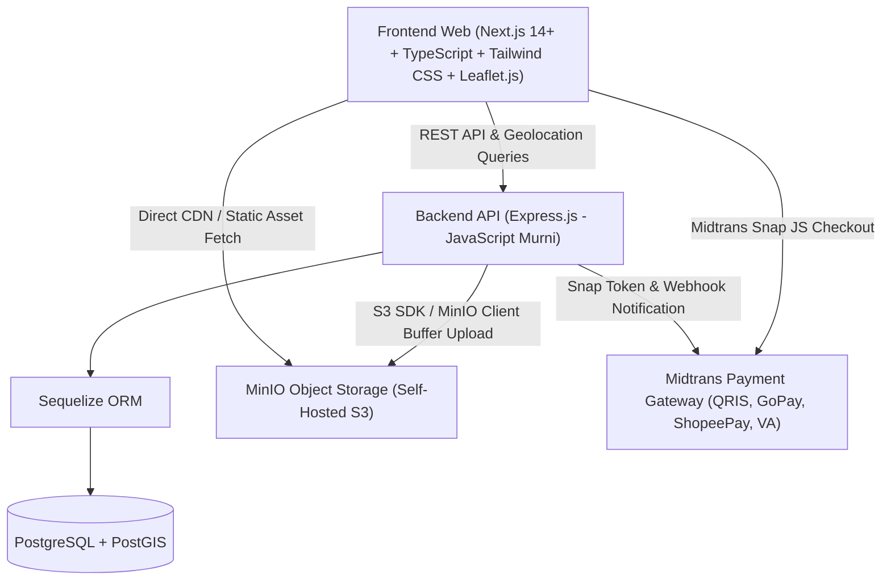
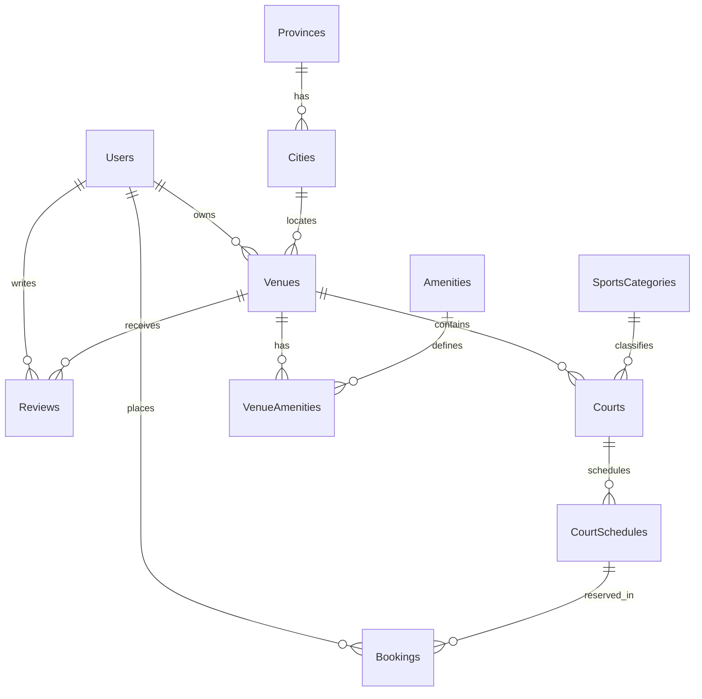

# SPESIFIKASI DAN RENCANA IMPLEMENTASI APLIKASI LAPANG (INDONESIA)
**Platform Manajemen, Pencarian & Reservasi Lapangan Olahraga Seluruh Indonesia (Lapang.id)**

---

## 1. Ringkasan Eksekutif & Visi Sistem

Aplikasi ini adalah platform *two-sided* yang menghubungkan pencari lapangan olahraga di seluruh Indonesia dengan pemilik/pengelola venue olahraga:
- **Pencari Lapang (User):** Menemukan lapangan terdekat melalui peta interaktif, memfilter berdasarkan jenis olahraga dan spesifikasi fasilitas, membaca ulasan pemain terverifikasi, melihat galeri foto resolusi tinggi, serta memesan slot waktu secara real-time via QRIS / Virtual Account.
- **Pengelola Lapang (Venue Owner):** Mengelola inventaris sub-lapangan (*courts*), jadwal operasional, tarif dinamis per jam, pencatatan sewa offline & online, serta merespons ulasan pengunjung.
- **Skala Geografis:** Skala nasional (38 Provinsi, 514 Kota/Kabupaten di Indonesia) dengan dukungan geolokasi GPS presisi dan filter radius.
- **Referensi Desain UI/UX:** Mengacu penuh pada rancangan antarmuka interaktif pada `mockup/code.html`.

---

## 2. Arsitektur Teknologi (Tech Stack)

Sistem menggunakan arsitektur modular terpisah antara Backend API (JavaScript murni) dan Frontend Web (Next.js + TypeScript):



### Rincian Komponen Teknologi:
| Layer | Teknologi | Peran & Alasan |
| :--- | :--- | :--- |
| **Backend** | **Express.js (Node.js - JavaScript Murni)** | Ringan, cepat, fleksibel, mudah dirawat tanpa kompleksitas kompilasi TypeScript. |
| **ORM** | **Sequelize ORM** (`sequelize`, `pg`, `pg-hstore`) | ORM standar industri Node.js, mendukung migrasi data, relasi kompleks, dan tipe data spasial (`DataTypes.GEOMETRY`). |
| **Database** | **PostgreSQL (didukung PostGIS)** | Database relasional tangguh untuk integritas transaksi booking (ACID) dan kueri geospasial jarak radius. |
| **Penyimpanan Media** | **MinIO Object Storage** | Penyimpanan objek mandiri kompatibel AWS S3 API untuk menyimpan galeri foto lapangan, foto review, dan dokumen venue. |
| **Frontend** | **Next.js (App Router) + TypeScript** | Performa tinggi, SEO-friendly, *type-safety*, rendering cepat, dan struktur komponen modular. |
| **Styling & Icons** | **Tailwind CSS + Lucide React + Plus Jakarta Sans** | Sesuai acuan desain `mockup/code.html`: palette warna brand hijau premium, responsif, elegan. |
| **Peta Interaktif** | **Leaflet.js + OpenStreetMap (SSR-safe dynamic import)** | Peta interaktif ringan tanpa biaya kuota API, custom sport pin markers, cluster, dan popup interaktif. |
| **Pembayaran** | **Midtrans (Snap API & Core API)** | Standar pembayaran di Indonesia: QRIS otomatis, GoPay, ShopeePay, dan Virtual Account (BCA, Mandiri, BNI, BRI). |

---

## 3. Desain Antarmuka & Komponen Frontend (Acuan `mockup/code.html`)

Tampilan frontend mengacu 100% pada struktur visual dan alur pengguna yang didefinisikan dalam `mockup/code.html`:

### A. Design System & Token Visual
- **Tipografi:** Google Fonts `Plus Jakarta Sans` (Weight: 400, 500, 600, 700, 800).
- **Palet Warna Brand (Emerald Theme):**
  - `brand-900`: `#0e3813` (Teks kontras & header gelap)
  - `brand-800`: `#1B5E20` (*Primary Green* - Tombol utama, header aksen, logo, pin marker)
  - `brand-700`: `#2e7d32` (Hover state)
  - `brand-600`: `#388e3c` (Border aktif & highlight)
  - `brand-500`: `#4CAF50` (*Secondary Green* - Badge status & progress bar rating)
  - `brand-300`: `#A5D6A7` (*Accent Soft Green* - Slot tersedia & focus ring)
  - `brand-100`: `#e8f5e9` (Badge background)
  - `brand-50`: `#f1f8e9` (Background highlight kartu & banner radius)
- **Pin Marker Khusus Tiap Cabang Olahraga:**
  - ⚽ Futsal & Mini Soccer: `#1B5E20` (Emerald Green)
  - 🏸 Badminton: `#f59e0b` (Amber Gold)
  - 🏀 Bola Basket: `#ea580c` (Deep Orange)
  - 🎾 Tenis & Padel: `#2563eb` (Royal Blue)
  - 🏐 Bola Voli: `#059669` (Teal Green)
  - Setiap pin dilengkapi badge harga mengambang (misal `Rp 175.000`) dan animasi hover `scale(1.15)`.

### B. Komponen Utama Layar Utama (Main Screen)
1. **Top Navigation App Bar:**
   - Brand Logo `Lapang.id` dengan ikon `compass` dan badge tag `Nasional`.
   - Bar pencarian cepat (*Quick Search Bar*): Nama lapangan, GOR, kota.
   - Tombol Geolocation *"Dekat Saya"* dengan ikon `crosshair` (deteksi GPS browser).
   - Menu aksi: *"Daftarkan Venue"*, ikon kalender riwayat booking dengan indikator notifikasi, profil avatar pemain (*"Rian Pratama - Verified Player 🏅"*).
2. **Filter & Category Chips Bar:**
   - Sport Category Pills: *"Semua Cabang"*, *"Futsal & Mini Soccer (⚽)"*, *"Badminton (🏸)"*, *"Basket (🏀)"*, *"Tenis & Padel (🎾)"*, *"Bola Voli (🏐)"*.
   - City Selector Dropdown: *"Seluruh Indonesia (38 Provinsi)"*, Jabodetabek, Bandung Raya, Surabaya, Bali/Denpasar, Medan, Makassar.
   - Tombol *"Filter Spesifikasi"* dengan ikon `sliders-horizontal`.
3. **Split-Screen Layout (Katalog Kiri & Peta Kanan):**
   - **Katalog Lapangan (Sisi Kiri, 38-48% lebar layar desktop):**
     - Header ringkasan jumlah venue (misal *"6 Venue"*), subtext lokasi aktif, dan dropdown sorting (*Rekomendasi, Harga Terendah, Rating Tertinggi, Jarak Terdekat*).
     - Bar filter radius cepat: `5 km`, `10 km`, `25 km`, `Semua`.
     - Kartu Venue (*Venue Card*): Thumbnail foto resolusi tinggi, badge rating bintang, tag cabang olahraga, indikator jarak GPS, nama venue, alamat, badge tipe ruangan & *"Tersedia Hari Ini"*, tarif per jam, tombol *"Lihat Jadwal"*.
   - **Peta Interaktif (Sisi Kanan, 52-62% lebar layar desktop):**
     - Wadah peta Leaflet full-height.
     - Overlay badge *"GPS Live Sync"* dengan animasi ping dot.
     - Legenda pin peta warna-warni berdasarkan cabang olahraga.
     - Tombol mengambang *"Lihat Peta Indonesia"* untuk me-recenter pandangan ke seluruh nusantara.
     - Popup kustom: Kartu ringkas dengan foto, rating, nama venue, jarak, tarif, dan tombol *"Detail & Slot"*.

### C. Modal & Drawer Interaktif
1. **Venue Detail Drawer (Panel Geser dari Kanan):**
   - Header drawer: Tombol kembali, nama venue, kota/provinsi, tombol bagikan tautan, tombol favorit (bookmark/heart), tombol tutup (X).
   - Galeri Foto Multi-Grid (Asset dari MinIO): Foto utama besar + 2 foto detail + badge *"Verified MinIO S3 Storage"*.
   - Skor Rating & Badge Jaminan: Rating angka besar (misal `4.9 ★★★★★`), jumlah ulasan terverifikasi, badge *"⚡ Konfirmasi Instan"*, *"🛡️ Bebas Reschedule"*.
   - Informasi Venue: Deskripsi mendalam, jam operasional, jenis lantai.
   - Grid Fasilitas Penunjang (*Amenities*): Parkir luas, shower air hangat, kantin, musholla ber-AC, loker, sewa alat.
   - Pemilih Slot Waktu (*Time Slot Grid*):
     - Tab pergantian tanggal *"Hari Ini"* vs *"Besok"*.
     - Indikator status visual: *Tersedia* (hijau lembut), *Dipilih* (hijau tua pekat), *Penuh/Terisi* (abu-abu dicoret).
   - Bagian Ulasan Pemain Terverifikasi:
     - Breakdown 4 aspek: Kualitas Lantai, Penerangan Lampu, Kebersihan Toilet, Pelayanan Staf.
     - Kartu review: Avatar, nama pengulas, badge *"Verified Booker"*, rating bintang, waktu relatif, teks komentar, dan kotak resmi *"Tanggapan Pengelola"*.
     - Tombol `+ Tulis Ulasan`.
   - Sticky Footer: Kalkulasi total biaya sewa dan tombol aksi *"Pesan Sekarang (QRIS/VA)"*.
2. **Filter Specification Modal (Modal Mengambang):**
   - Filter Tipe Ruangan: Indoor (AC), Outdoor, Semi-Indoor.
   - Filter Permukaan Lantai: Rumput Sintetis (FIFA), Vinyl Matras (BWF), Interlocking, Parquet Kayu.
   - Filter Fasilitas Wajib: Shower Air Hangat, Musholla Bersih, Parkir Luas, Kantin/Kafe.
3. **Checkout Success / QRIS Payment Modal (Integrasi Midtrans):**
   - Ikon centang sukses ganda.
   - Judul reservasi berhasil & nomor unik kode booking (`LAPANG-2024-ID-XXXX`).
   - Rincian pesanan: Nama venue, jadwal main, metode bayar (*QRIS Instan Pay*), total tagihan.
   - Tampilan Barcode / QRIS dinamis untuk pembayaran lewat GoPay, OVO, ShopeePay, BCA, Livin Mandiri.
   - Tombol *"Selesai & Buka E-Tiket"*.

---

## 4. Desain Penyimpanan Media (MinIO Object Storage)

MinIO dikonfigurasi dengan arsitektur multi-bucket:

```
minio-server/
├── lapang-venues/        (Public Read) -> Foto venue, banner, dan foto detail sub-lapangan
├── lapang-reviews/       (Public Read) -> Foto dokumentasi ulasan dari pengguna
└── lapang-documents/     (Private)     -> Dokumen legalitas/KTP pemilik venue untuk proses verifikasi
```

### Alur Pemrosesan Berkas:
1. File dikirim oleh klien melalui endpoint Express.js (`multipart/form-data` via `multer`).
2. Express.js melakukan validasi keamanan berkas (*magic bytes* via `file-type`).
3. Gambar dioptimasi dan dikonversi otomatis ke format WebP menggunakan pustaka `sharp`.
4. Buffer gambar disimpan ke MinIO menggunakan UUID acak sebagai nama berkas (mencegah *path traversal*).
5. URL publik MinIO disimpan ke PostgreSQL melalui Sequelize ORM.

---

## 5. Pemodelan Data & Skema Sequelize ORM (JavaScript)



### Rincian Model Sequelize:
1. **`User` (`models/user.js`)**: `id` (UUID), `name`, `email`, `phone`, `password_hash`, `role` (`user`, `owner`, `admin`).
2. **`Province` & `City` (`models/province.js`, `models/city.js`)**: Master data 38 provinsi dan kota/kabupaten di Indonesia.
3. **`Venue` (`models/venue.js`)**:
   - `id`: UUID
   - `owner_id`: UUID
   - `city_id`: INTEGER
   - `name`, `slug`, `description`, `address`
   - `latitude`: DECIMAL(10, 8), `longitude`: DECIMAL(11, 8)
   - `location`: GEOMETRY('POINT') *(PostGIS spatial point)*
   - `phone_number`: STRING
   - `opening_hours`: JSONB
   - `main_image_url`: STRING (MinIO URL)
   - `gallery_images`: JSONB (Array MinIO URLs)
   - `rating_avg`: DECIMAL(2, 1)
   - `review_count`: INTEGER
   - `is_verified`: BOOLEAN
4. **`SportsCategory` (`models/sportsCategory.js`)**: `id` (e.g. `'futsal'`, `'badminton'`), `name`, `icon_url`, `color_hex`.
5. **`Court` (`models/court.js`)**: `id` (UUID), `venue_id`, `category_id`, `name`, `floor_type`, `court_type`, `base_price_hourly`, `images` (JSONB).
6. **`Review` (`models/review.js`)**:
   - `id`: UUID, `venue_id`, `user_id`, `booking_id`
   - `rating_overall`: DECIMAL(2, 1)
   - `rating_cleanliness`, `rating_court_condition`, `rating_lighting`, `rating_hospitality`: INTEGER (1 - 5)
   - `comment`: TEXT, `photos`: JSONB, `owner_reply`: TEXT, `owner_replied_at`: DATE
7. **`CourtSchedule` & `Booking` (`models/courtSchedule.js`, `models/booking.js`)**:
   - Jadwal slot per jam, status (`available`, `booked`, `blocked`, `maintenance`), locking transaksi ACID, integrasi Snap Token Midtrans, status transaksi (`pending`, `settlement`, `expire`, `cancel`).

---

## 6. Desain RESTful API (Express.js)

### Endpoint Utama:
- `GET /api/v1/venues` - Pencarian lapang: `lat`, `lng`, `radius_km`, `city_id`, `sport`, `court_type`, `sort`, `page`.
- `GET /api/v1/venues/:slug` - Detail venue, daftar courts, galeri MinIO, fasilitas, jadwal operasional.
- `GET /api/v1/venues/:id/reviews` - Ulasan terverifikasi dan rating breakdown.
- `POST /api/v1/venues/:id/reviews` - Input review baru + upload foto ke MinIO.
- `POST /api/v1/venues/:id/reviews/:reviewId/reply` - Respon ulasan oleh pemilik venue.
- `GET /api/v1/courts/:courtId/schedules?date=YYYY-MM-DD` - Ketersediaan slot waktu real-time.
- `POST /api/v1/bookings` - Membuat reservasi atomik & memanggil Midtrans Snap API.
- `POST /api/v1/payments/midtrans-webhook` - Webhook notifikasi pembayaran dari Midtrans.
- `POST /api/v1/media/upload` - Upload gambar ke MinIO dengan validasi magic bytes & konversi WebP.

---

## 7. Struktur Direktori Proyek

```
lapang/
├── SPECIFICATION.md                 # Spesifikasi teknis (file ini)
├── STANDARD_CODE.md                 # Standar kualitas kode & keamanan pentest-ready
├── mockup/
│   └── code.html                    # Acuan desain visual & interaksi UI/UX
├── backend/                         # Express.js Application (JavaScript Murni)
│   ├── package.json
│   ├── server.js                    # Inisialisasi HTTP server & graceful shutdown
│   ├── app.js                       # Express app, Helmet, CORS, Error Handler
│   ├── config/
│   │   ├── database.js              # Konfigurasi Sequelize & PostgreSQL
│   │   ├── minio.js                 # Konfigurasi MinIO SDK
│   │   └── midtrans.js              # Konfigurasi Midtrans Snap Client
│   ├── constants/                   # Enum role, status booking, kode olahraga
│   ├── controllers/                 # HTTP Request Handlers
│   ├── middlewares/                 # Auth, RBAC, Multer upload, Joi validators
│   ├── models/                      # Model Sequelize (Venue, Court, Review, Booking, dll)
│   ├── routes/                      # Route definisi REST API
│   ├── services/                    # Business Logic (Venue, Booking ACID, MinIO, Midtrans)
│   ├── utils/                       # Response helper, spatial utils
│   └── seeders/                     # Seeder 38 provinsi, kategori, & venue realistis
└── frontend/                        # Next.js App Router (TypeScript + Tailwind CSS)
    ├── package.json
    ├── tsconfig.json
    ├── tailwind.config.ts           # Konfigurasi warna brand-800, Plus Jakarta Sans
    ├── src/
    │   ├── app/
    │   │   ├── layout.tsx           # Root layout dengan Plus Jakarta Sans font
    │   │   ├── page.tsx             # Main Split View (Katalog + Leaflet Map)
    │   │   └── globals.css          # Styling scrollbar kustom & popup Leaflet
    │   ├── components/
    │   │   ├── Header/              # Top App Bar, Quick Search, Geolocation button
    │   │   ├── Filters/             # Sport chips bar, city select, spec modal
    │   │   ├── Catalog/             # Venue card list, sorting, radius bar
    │   │   ├── Map/                 # Dynamic Leaflet Map, custom sport pins, popup
    │   │   ├── Drawer/              # Venue detail drawer, MinIO gallery, slot picker
    │   │   ├── Reviews/             # Rating breakdown, verified review cards
    │   │   └── Checkout/            # Modal pembayaran QRIS Midtrans
    │   ├── types/                   # TypeScript interfaces (Venue, Court, Review, Slot)
    │   ├── services/                # API client fetchers
    │   └── hooks/                   # Custom hooks (useGeolocation, useVenues)
```

---

## 8. Rencana Tahapan Eksekusi Bertahap (Roadmap)

### **Tahap 1: Setup Proyek & Database (Backend Express + Sequelize + MinIO)**
- Inisialisasi `backend/` dengan Express.js (JavaScript murni).
- Setup Sequelize ORM ke PostgreSQL + PostGIS.
- Setup MinIO Object Storage service (`minioService.js`) untuk pembuatan bucket otomatis (`lapang-venues`, `lapang-reviews`).
- Membuat migrasi tabel dan seeder awal data kota di Indonesia, cabang olahraga, dan 6 data venue realistis seperti pada `mockup/code.html`.

### **Tahap 2: Inisialisasi Frontend Next.js & Desain Visual Sesuai `code.html`**
- Inisialisasi `frontend/` menggunakan Next.js (App Router) + TypeScript.
- Setup Tailwind CSS dengan token warna `brand-800` (`#1B5E20`), font `Plus Jakarta Sans`, dan ikon Lucide React.
- Menerjemahkan komponen `mockup/code.html` ke dalam komponen modular React:
  - `Header` & `QuickSearchBar`
  - `SportFilterChips` & `CitySelector`
  - `VenueCardList` & `RadiusFilterBar`
  - `LeafletMap` (dengan Leaflet dynamic import untuk mencegah isu SSR Next.js) dengan custom sport pin markers & popup.

### **Tahap 3: Implementasi Venue Detail Drawer, Galeri MinIO & Ulasan**
- Pembuatan komponen `VenueDetailDrawer` dengan galeri foto multi-grid.
- Integrasi pemilih slot waktu interaktif (Hari Ini vs Besok) dengan status visual ketersediaan.
- Komponen ulasan terverifikasi dengan breakdown rating 4 aspek dan kotak respon pengelola.
- Modal filter spesifikasi lapangan (tipe lantai, ruangan, fasilitas).

### **Tahap 4: Sistem Reservasi Atomik & Pembayaran Midtrans**
- Implementasi endpoint `POST /api/v1/bookings` dengan transaksi Sequelize ber-kunci baris (`LOCK.UPDATE`) guna mencegah double booking.
- Integrasi Midtrans Snap API untuk memproduksi QRIS dan Virtual Account.
- Pembuatan modal checkout dan simulasi verifikasi tiket dengan kode booking.

### **Tahap 5: Pengujian Pentest, Optimasi Performa & Rilis**
- Uji kepatuhan OWASP sesuai checklist di `STANDARD_CODE.md` (SQLi, IDOR, MIME type check, Rate limiting).
- Optimasi performa peta di perangkat mobile.
- Penyiapan dokumentasi penggunaan dan peluncuran sistem.
